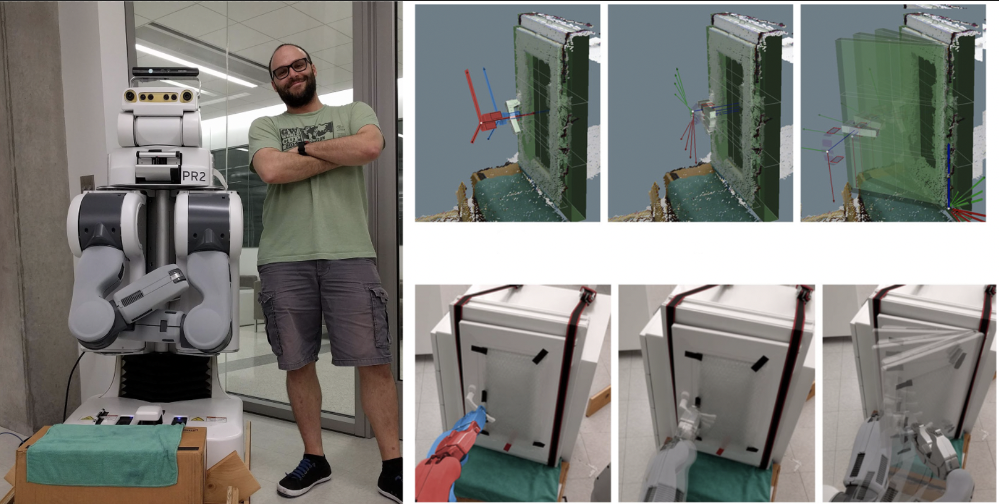
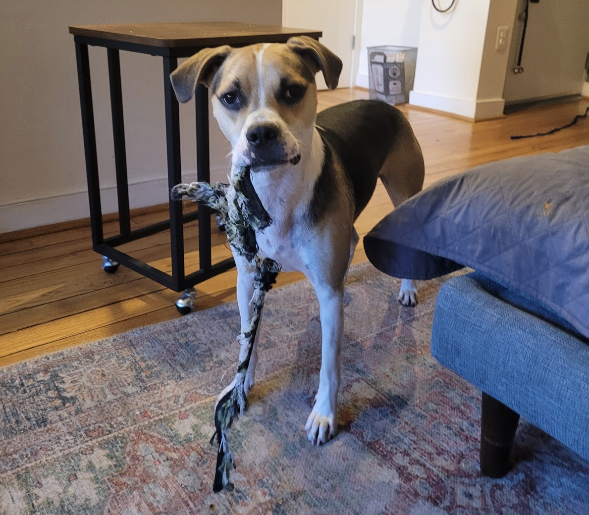
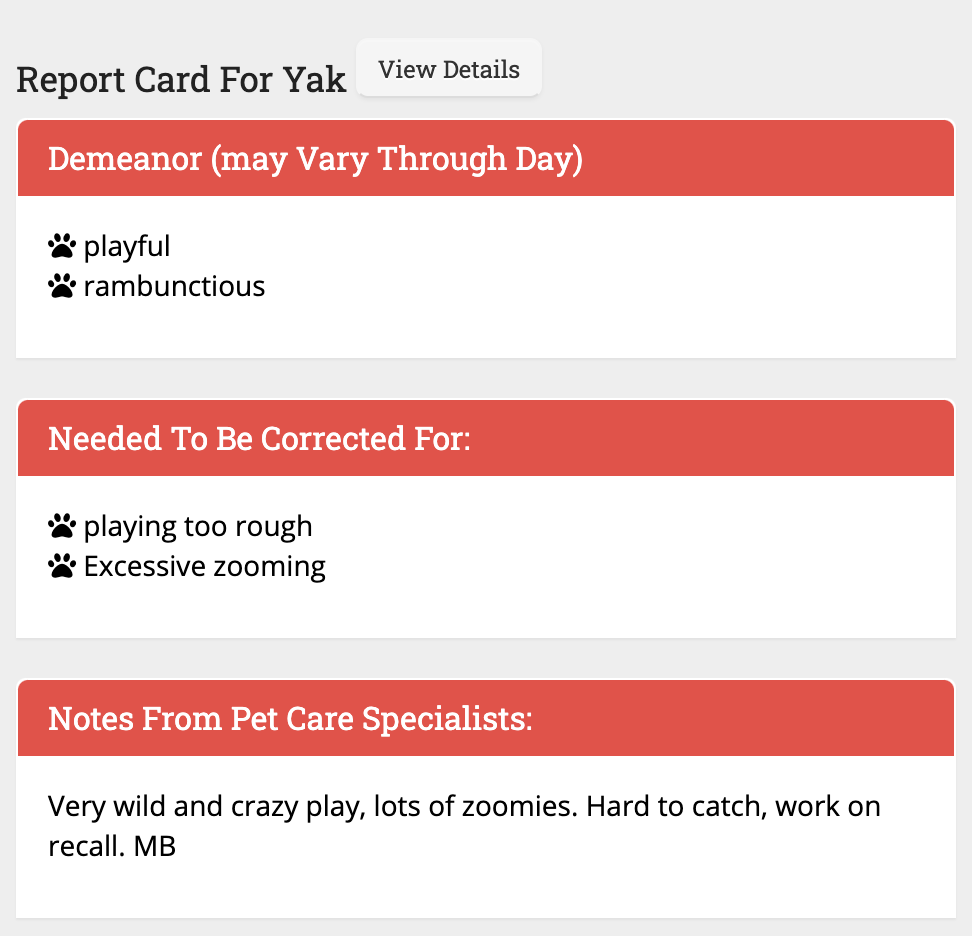
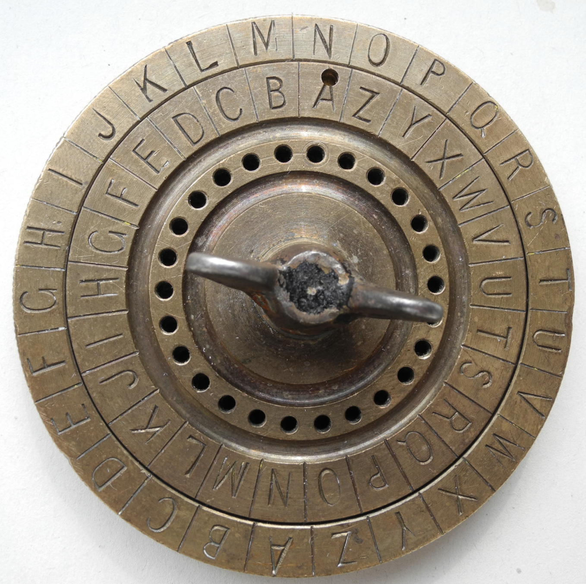
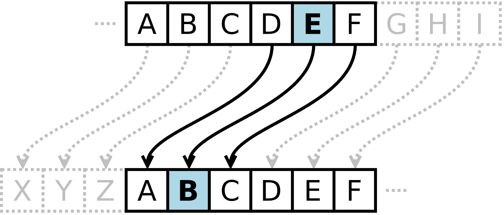
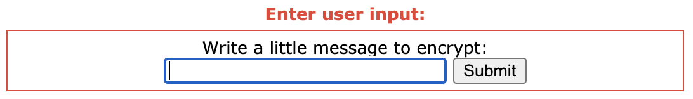
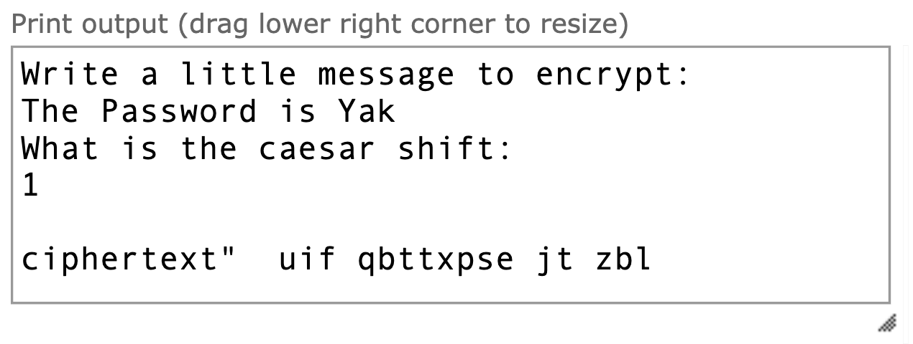
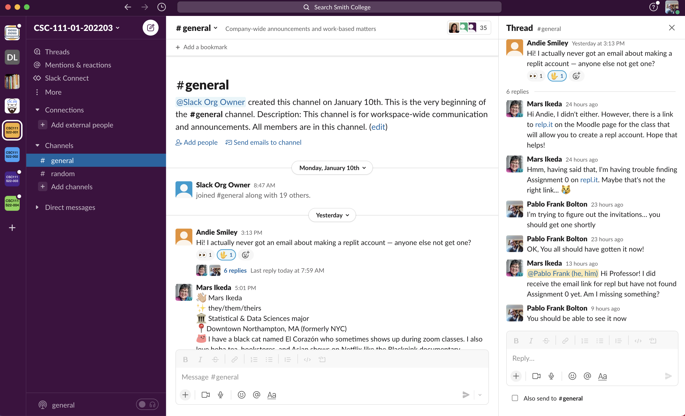
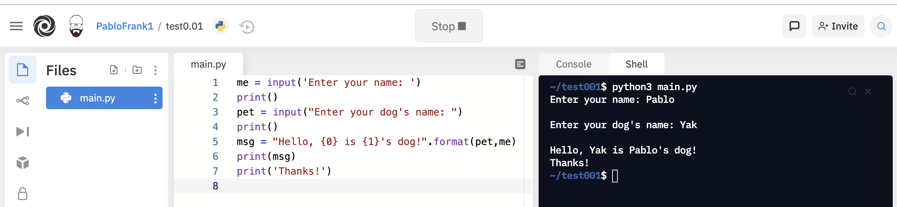

::: {.container .py-1}
{.float-right
height="120"}

# CSC 111 {#csc-111 .display-3 .m-0}

Introduction to Computer Science Through Programming

Smith Computer Science
:::

::: {.container .py-0}
[{width="30"
height="30"}](../../../../index.html){.navbar-brand}

[]{.navbar-toggler-icon}

::: {#navbarFive .collapse .navbar-collapse}
-   [Home](../../../index.html){.nav-link .mx-lg-2}
-   [Class Info [(current
    page)]{.sr-only}](../class-info.html){.nav-link .mx-lg-2}
-   [Schedule and Lectures](../schedule.html){.nav-link .mx-lg-2}
-   [Labs](../labs.html){.nav-link .mx-lg-2}
-   [Homework](#){#navbarDropdown2 .nav-link .dropdown-toggle}

    ::: {.dropdown-menu aria-labelledby="navbarDropdown2"}
    [HW Assignments](#){.dropdown-item} [TBD 1](#){.dropdown-item} [TBD
    2](#){.dropdown-item}

    ::: dropdown-divider
    :::

    [Final Project (if any)](#){.dropdown-item}
    :::
-   [Tools and Links](#){#navbarDropdown .nav-link .dropdown-toggle}

    ::: {.dropdown-menu aria-labelledby="navbarDropdown"}
    [Slack](#){.dropdown-item} [Moodle](#){.dropdown-item}
    [Repl.it](#){.dropdown-item}

    ::: dropdown-divider
    :::

    [School Calendar](#){.dropdown-item}
    :::

```{=html}
<!-- -->
```
-   [Next Module](./lectureNotes02.html){.nav-link .mx-lg-2}
:::
:::

::: {.container .pb-5}
::: {.col-xs-0 .col-md-2}
:::

::: {.col-xs-12 .col-md-10}
\
\

# Lecture Notes 01: Welcome to CSC 111

\

\

------------------------------------------------------------------------

\

## Before Starting:   [**REMINDER:** ]{style="color:#06a015"} :Remind Pablo to record the lecture!!

::: {.container .m-5}
\
\
Now\...Who\'s who and why are we here?

\
\

#### Pablo

Name: Pablo Frank Bolton (\"Frank\" and \"Bolton\" are last names);\
Pronouns: He, Him;\
you can call me \"Pablo\"\
\
**What do I do?**

-   Human-Computer-Interaction\
    {.img-max}\
    \
-   Biology-CS collaborations\
    {.img-max}\
    \
-   Teaching and STEM research\
    {.img-max}

\
\

#### My Dog Yak

this is my dog, Yak:\

::: row
::: {.col-lg-5 .col-md-5 .col-xs-5 .thumb}
[{.img-responsive
style="width:100%"}](#){.thumbnail}
:::

::: {.col-lg-5 .col-md-5 .col-xs-5 .thumb}
[{.img-responsive
style="width:90%"}](#){.thumbnail}
:::
:::

(Informal Dog-Walk Hours can be used for petting Yak, chatting with me,
or even to talk shop)\
\

#### Instructional Team

Names: TBD

\
\

#### The Students

Please fill out this small
[3-minute-biography](https://forms.gle/tsrBCm1ShRLFxKkf8) so I can get
to know you a bit.

\
\

#### The Class

\
\

[**Activity 1**]{style="color:#06a015"} :\[2 minutes\] : Can anyone tell
me what Computer Science is?

::: {.container .m-5}
[One possible answer]{style="color:#000000"}:

(Wait until we have a couple definitions; then Click to expand and see
mine.)\
\

*Computer Science is the structured study of, and the design of
solutions for, problems that are solvable with an algorithm.*

::: {.container .mx-lg-5}
[**And what is an algorithm?**]{style="color:#888888"}\
[One possible answer: ]{style="color:#888888"}

(Wait; then Click)

*A series of steps that allow you to solve a problem.*\
(there is a bit more than that, but for now, that\'s enough)
:::

\
\

-   Computer Science is not simply a collection of data to be memorized.

-   CS is a way to approach the analysis of a problem and the design of
    a solution for it.

-   The fact that it has \"computer\" in the name is an indication of
    the *way* we think of and design solutions for these problems.

-   A computer requires *structure* and *organization* to be able to
    function and so, CS is the discipline that teaches one to **think in
    a structured and organized manner of ways to analyze and solve
    problems**.\
    However, we can do CS without computers as long as we *think* the
    right way.\
    \

    > *\"Computer Science is no more about computers than astronomy is
    > about telescopes\"*
    >
    > Edsger Dijkstra MIT

    [Dijkstra was a Dutch Computer Scientist that was good (The Serena
    Williams of CS). ]{.mx-5 style="collor:#888888"}

-   You will see many similarities with engineering, mathematics, and
    physics because 1) CS is the descendant those fields, and 2) it
    inherits the scientific method.
:::

[**Activity 2**]{style="color:#06a015"} :\[2 minutes\] : Can anyone tell
me what programming is and why you think it is useful?

::: {.container .m-5}
[One possible answer]{style="color:#000000"}:

(Wait; then Click)\
\

*Programming is the translation of an algorithm into structured and
unambiguous steps that are readable by some agent.*\
\
:::

This class has three main objectives:

-   **Learn the Language**: learning the Syntax (spelling rules) and
    struture of a programming language (Python) as well as the basics of
    how it is executed by the computer;
-   **Computational Thinking**: learning how to understand, analyze, and
    solve problems \"through\" the computer (Python);
-   **Applied Programming**: connect what you learn in this class to
    other fields like art, gaming, literature, walking your dog, etc).

\
\
**A Most Important Point:** This course is designed so that anyone can
learn to program and do well even without any prior experience!

\

------------------------------------------------------------------------

\

## An example of things we\'ll do

#### Caesar Cipher

::: row
::: {.col-lg-6 .col-md-6 .col-xs-6 .thumb}
[{.img-responsive
style="width:50%"}](#){.thumbnail}
:::

::: {.col-lg-6 .col-md-6 .col-xs-6 .thumb}
[{.img-responsive
style="width:100%"}](#){.thumbnail}
:::
:::

\
\
Follow these steps:

1.  Open this link in another window: [Python Application: Caesar
    Encryption](https://pythontutor.com/visualize.html#code=import%20string%0A%0A%23%20Taking%20input%20from%20user%0Adata%20%3D%20input%28'Write%20a%20little%20message%20to%20encrypt%3A%5Cn'%29%0Adata_low%20%3D%20data.lower%28%29%0Ashift%20%3D%20int%28input%28'What%20is%20the%20caesar%20shift%3A%5Cn'%29%29%0A%0A%23%20Creating%20converted%20output%0Aconverted_data%20%3D%20%22%22%0A%0Afor%20i%20in%20range%280,%20len%28data_low%29%29%3A%0A%20%20%20%20if%20data_low%5Bi%5D%20in%20string.ascii_lowercase%3A%0A%20%20%20%20%20%20%20%20data_int%20%3D%20ord%28data_low%5Bi%5D%29%0A%20%20%20%20%20%20%20%20converted_data%20%2B%3D%20chr%28%20%28data_int%20-%2097%20%2B%20shift%29%2526%20%2B%2097%20%29%0A%20%20%20%20else%3A%0A%20%20%20%20%20%20%20%20converted_data%20%2B%3D%20data%5Bi%5D%0A%0A%23%20Printing%20converted%20output%0Aprint%28%29%0Aprint%28'ciphertext%3A%20',converted_data%29&cumulative=false&heapPrimitives=nevernest&mode=edit&origin=opt-frontend.js&py=3&rawInputLstJSON=%5B%22aB%24%20%25Yz%22,%221%22%5D&textReferences=false)
2.  press the **Visualize Execution**
3.  Write a message in the little box and press Submit:\
    {.img-responsive
    style="width:60%"}
4.  You can press **Next** to see the execution of the code
    step-by-step\
    OR\
    press **Last** in order to get to the end!
5.  Look at the encoded message that is \"printed\":\
    {.img-responsive
    style="width:60%"}

[**Activity 3**]{style="color:#06a015"} :\[1 minute\] : In breakout
groups\...Decrypt this:\
[zl qbt vf orggre guna lbhef]{style="color:magenta"}

\

------------------------------------------------------------------------

\

## Remaining checklist for today:

1.  Course Information
2.  Locate the course page on Moodle
3.  Locate Discord info on Moodle and Sign up to Discord.
4.  Locate ZyBooks info on Moodle and Sign up to ZyBooks.
5.  Locate Repl.it info on Moodle and Sign up to Repl.it
6.  Meeting and Accommodations

\

------------------------------------------------------------------------

\

## Course Information

The class information is located in the [Class Info](../class-info.html)
link of the navigation bar. We will go over it now. When we are done
checking it out, make sure to continue here.

\

------------------------------------------------------------------------

\

## Using Slack

We will use Slack as our main communication hub.\

-   Please sign up for Slack:
    {.img-fluid}
-   We\'ll be working inside a **Workspace** for the course
    (CSC-111-01-202203). Each workspace has **channels** (#general,
    #random) where different subjects can be discussed. And lastly, you
    can reply to a speciffic post and continue the conversation inside a
    **Thread**. This lets us group conversations by subject matter.
-   Join the https://smi-csc-111-01-202203.slack.com workspace.\
    (You should have been invited already, otherwise talk to me after
    class)
-   You can read [this
    tutorial](https://slack.com/help/articles/360059976673-Slack-video-tutorials)
    to get an idea of how to use it.

\

------------------------------------------------------------------------

\

## Using Moodle

Access Moodle here: <https://moodle.smith.edu/>\
We\'ll keep links to each lecture in Moodle. In addition, we\'ll have
any PDFs, readings, and other resources.\
I\'ll update the course Moodle with the appropriate links and
information as we move forward in the course.

\

------------------------------------------------------------------------

\

\

------------------------------------------------------------------------

\

## Using Repl.it

Repl.it (AKA replit) is a **free**, collaborative, in-browser IDE. An
IDE is an Integrated Development Environment, which is a fancy way of
saying \"a text editor that can also check and run your code\".\
\
{.img-fluid}\
\
The important part is that we\'ll be able to exchange files and check
your work through replit, making it easier to check your code for
errors, grade your work, and distribute templates to get you started.\
\
\
(You should have been invited already, otherwise talk to me after class)

\

------------------------------------------------------------------------

\

## Meeting and Accommodations

I would be very happy to meet you during office hours.\
This will help me get to know you and learn how best to communicate.\
\
Office Hours are **not** for remedial or emergency meetings, its part of
the **academic experience**!\
In OHs, we can talk about the class work and organization, but also
about aspirations, expectations, curiosities, and more.\
I really like office hours, so please feel free to drop by.\
\
You may take this opportunity to let me know if you have arranged any
accommodations with ODS.

\

------------------------------------------------------------------------

\

#### Before next class (Wednesday)

\
\
**\[Due for everyone\]**\
Read the Course-Info page (There\'ll be a quiz about it next class)\
Watch the Crash Course Computer Science #1 video (in Moodle)\
**\[Optional\]** Take a look at the code of \"Caesar Cipher\" in
Replit\... and play with it\... try to get a sense of what it is doing.

\

------------------------------------------------------------------------

\

#### 1-Minute Debrief

\
\
Please fill out the following debrief (we\'ll use these for
attendance):\
[1-minute debrief](https://forms.gle/6wouxX9Fy84ovw7u9)

::: {.col-xs-0 .col-md-2}
:::
:::
:::

::: {.collapse .navbar-collapse}
-   [Go to the Top](#){.nav-link .mx-lg-2}

```{=html}
<!-- -->
```
-   [Previous Module](#){.nav-link .mx-lg-2 .disabled}
-   [Next Module](./lectureNotes02.html){.nav-link .mx-lg-2}
:::
:::
